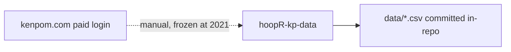
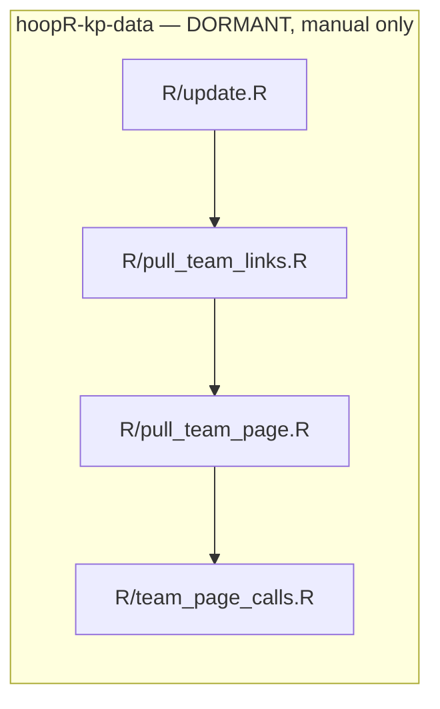

# hoopR-kp-data

> **DORMANT REPOSITORY — no automation exists here.**
>
> - There is **no working CI**. The old `.github/workflows/update_kenpom.yml`
>   was a zombie: it checked out the repo and installed R dependencies, then
>   ended — it had no run step and could never scrape anything. It has been
>   removed.
> - `R/update.R` is a **manual one-off frozen at `yr <- 2021`**: hardcoded
>   year and package version (`version <- "0.2.3"`), interactive paid KenPom
>   login via the `kp_user` / `kp_pw` environment variables, and an inline
>   `git2r` add/commit/pull/push of `data/*` to `main`. It must be hand-edited
>   before every run.
> - `R/0000_create_hoopR_releases_init.R` and
>   `R/0001_push_existing_release_data.R` are **one-time bootstraps** (they
>   create/backfill ESPN MBB/NBA release tags on `sportsdataverse-data`,
>   unrelated to KenPom). Do not re-run them.

## hoopR KenPom workflow diagram





No automation runs here; `R/update.R` is a manual one-off frozen at `yr <- 2021`.
`R/0000_*`/`R/0001_*` are one-time release bootstraps for the ESPN tags — do not
re-run them.

[hoopR-mbb-raw repository (source: ESPN)](https://github.com/sportsdataverse/hoopR-mbb-raw)

[hoopR-mbb-data repository (source: ESPN)](https://github.com/sportsdataverse/hoopR-mbb-data)

[hoopR-nba-raw repository (source: ESPN)](https://github.com/sportsdataverse/hoopR-nba-raw)

[hoopR-nba-data repository (source: ESPN)](https://github.com/sportsdataverse/hoopR-nba-data)

[hoopR-nba-stats-raw repository (source: NBA Stats)](https://github.com/sportsdataverse/hoopR-nba-stats-raw)

[hoopR-nba-stats-data repository (source: NBA Stats)](https://github.com/sportsdataverse/hoopR-nba-stats-data)

[ncaa-mbb-hoops-raw repository (source: stats.ncaa.org)](https://github.com/sportsdataverse/ncaa-mbb-hoops-raw)

[ncaa-mbb-hoops-data repository (source: stats.ncaa.org)](https://github.com/sportsdataverse/ncaa-mbb-hoops-data)

[hoopR-kp-data repository (source: KenPom, dormant)](https://github.com/sportsdataverse/hoopR-kp-data)

## What this repo is

R-side scraper that logs into [kenpom.com](https://kenpom.com) (paid
subscription required), walks every team page for a season, and commits the
parsed coaches / players / team schedules / depth charts under `data/` as
CSV + parquet + RDS. KenPom content is paywalled, so the parsed output is
**not** republished to `sportsdataverse-data` GitHub releases — it lives only
in this repo's committed `data/` tree.

## Where the data is consumed

- **No hoopR loader reads this repo.** The
  [hoopR](https://github.com/sportsdataverse/hoopR) R package's `kp_*()`
  functions are live authenticated scrapers of kenpom.com — they do not
  download from here (verified: zero references to `hoopR-kp-data` in the
  hoopR sources).
- **This repo has no GitHub releases**, so there are no release assets whose
  deletion could break package loaders.
- The only consumers are analysts / ad-hoc tooling reading the committed
  `data/` tree directly. Deleting `data/` would break those readers, but no
  package depends on it.

## Manual usage (if ever revived)

```sh
# Single-year scrape, no commit (edit the year inside first)
Rscript R/team_page_calls.R

# Scrape + commit + push — hand-edit yr/version in R/update.R first
Rscript R/update.R

# Rebuild the KenPom team-link index (data/kp_team_info.csv)
Rscript R/pull_team_links.R
```

All entry points require `KP_USER` / `KP_PW` (or lowercase `kp_user` /
`kp_pw`) env vars carrying valid paid KenPom credentials.

## Sibling repositories

- [hoopR-mbb-raw (source: ESPN)](https://github.com/sportsdataverse/hoopR-mbb-raw)
- [hoopR-mbb-data (source: ESPN)](https://github.com/sportsdataverse/hoopR-mbb-data)
- [hoopR-nba-raw (source: ESPN)](https://github.com/sportsdataverse/hoopR-nba-raw)
- [hoopR-nba-data (source: ESPN)](https://github.com/sportsdataverse/hoopR-nba-data)
- [hoopR-nba-stats-data (source: NBA Stats)](https://github.com/sportsdataverse/hoopR-nba-stats-data)

## Reports & explainers

<!-- BEGIN GENERATED: reports -->

| Report | What it is | Last updated |
|---|---|---|
| _none yet_ | — | — |

<!-- END GENERATED: reports -->

## Automation & status

<!-- BEGIN GENERATED: status -->

| workflow | schedule | last run |
|---|---|---|
| _none_ | — | — |

<!-- END GENERATED: status -->
